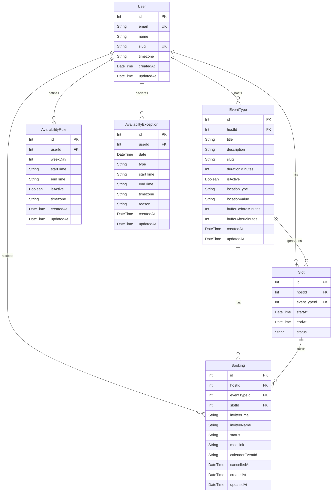

# Calendly Backend Application Clone

A robust, enterprise-grade backend for a **Calendly clone** designed to manage users, event types, availability schedules (recurring rules), and calendar exceptions. Built on a scalable **Layered (Clean) Architecture** using Express v5, TypeScript (strict mode), Prisma ORM, PostgreSQL, and Zod validation.

---

## 🏗️ Architecture & Clean Design Patterns

The project enforces a strict separation of concerns using a **Layered Architecture**. This keeps the domain logic, transport mechanism, and database layers decoupled, highly testable, and maintainable.

```
                  ┌─────────────────────────┐
                  │      HTTP Request       │
                  └────────────┬────────────┘
                               │
                               ▼
                  ┌─────────────────────────┐
                  │         Routers         │ (src/router/)
                  └────────────┬────────────┘
                               │
                               ▼
                  ┌─────────────────────────┐
                  │       Controllers       │ (src/controllers/)
                  └────────────┬────────────┘
                               │
                               ▼
                  ┌─────────────────────────┐
                  │        Services         │ (src/services/)
                  └────────────┬────────────┘
                               │
                               ▼
                  ┌─────────────────────────┐
                  │      Repositories       │ (src/repositories/)
                  └────────────┬────────────┘
                               │
                               ▼
                  ┌─────────────────────────┐
                  │      Prisma Client      │ (Database / PostgreSQL)
                  └─────────────────────────┘
```

### Layer Breakdown

1. **Routers (`src/router/`)**: Express routers mapping endpoints to corresponding controller functions.
2. **Controllers (`src/controllers/`)**: Handle HTTP serialization/deserialization. They read params, request body, headers, validate inputs with Zod, call the appropriate services, and output structured JSON responses.
3. **Services (`src/services/`)**: The core domain layer containing business rules, workflows, validation logic, and orchestrations.
4. **Repositories (`src/repositories/`)**: Abstract direct database interactions using Prisma client. Keeps data persistence concerns separate from the business logic.
5. **DTOs / Validation (`src/dtos/`)**: Type-safe Zod schemas representing request bodies/payload boundaries and their inferred TypeScript types.
6. **Middlewares (`src/middlewares/`)**: Global and route-specific logic (e.g., global error handling, headers authentication, request schema validations).

---

## 🛠️ Tech Stack

- **Runtime**: [Node.js](https://nodejs.org/) (ESM module system: `"type": "module"`)
- **Web Framework**: [Express v5](https://expressjs.com/) (Native async error propagation)
- **Database ORM**: [Prisma ORM](https://www.prisma.io/)
- **Database Engine**: PostgreSQL
- **Language**: [TypeScript](https://www.typescriptlang.org/) (Strict Mode)
- **Data Validation**: [Zod](https://zod.dev/)
- **Package Manager**: `pnpm`
- **Development Tooling**: Nodemon & `tsx`

---

## 📂 Project Structure

```
calendely-app/
├── AGENTS.md                  # Development instructions & agent guidelines
├── README.md                  # Project documentation (this file)
└── calendely-backend/
    ├── .env                   # Environment variables configurations
    ├── package.json           # Project scripts & dependencies configuration
    ├── tsconfig.json          # Strict TypeScript compiler options
    ├── prisma/
    │   ├── schema.prisma      # Prisma database model configuration
    │   └── migrations/        # SQL migration files history
    └── src/
        ├── app.ts             # Express Application initialization and routing
        ├── server.ts          # Server listener start-up script
        ├── config/            # Environment and Database adapter configs
        ├── controllers/       # Route handlers (express controller layer)
        ├── dtos/              # Zod validation schemas & static DTO types
        ├── middlewares/       # Request authentication, validation, error handler middlewares
        ├── repositories/      # Prisma direct query abstractions
        ├── router/            # Express route endpoint declarations
        ├── services/          # Core domain business logic
        └── utils/             # Express standardized API error / response utilities
```

---

## 🗄️ Database Schema & Entities

The entity relationship model includes standard calendaring models:



---

## ⚡ Getting Started

### Prerequisites

- Node.js (v18 or higher recommended)
- PostgreSQL database
- `pnpm` package manager installed globally (`npm install -g pnpm`)

### Setup Instructions

1. **Clone & Navigate**
   ```bash
   cd calendely-app/calendely-backend
   ```

2. **Install Dependencies**
   ```bash
   pnpm install
   ```

3. **Configure Environment Variables**
   Create a `.env` file in the `calendely-backend` root folder:
   ```env
   PORT=3001
   DATABASE_URL="postgresql://<username>:<password>@localhost:5432/<dbname>?schema=public"
   NODE_ENV=development
   ```

4. **Sync Prisma Models and Database**
   This formats the Prisma schema, generates the TypeScript client artifacts, and applies existing migrations:
   ```bash
   pnpm run prisma:all
   ```

5. **Start the Development Server**
   Runs the server in watch mode using `nodemon` and `tsx`:
   ```bash
   pnpm run dev
   ```
   The backend will start and listen on the port configured in `.env` (default is `3001` or `3000`).

---

## 📡 API Endpoints

### Standard Response Envelope

All API responses return a standardized payload envelope structure.

#### Success Response
```json
{
  "success": true,
  "data": { ... }
}
```
*Note: An optional `"message"` string may also be included.*

#### Error Response
```json
{
  "success": false,
  "message": "Error message details",
  "details": { ... }
}
```

---

### 1. Health Checks
* **Check Service Health**:
  * **Route**: `GET /health`
  * **Response**: `200 OK`
    ```json
    {
      "status": "ok!",
      "timestamp": "2026-07-12T10:20:00.000Z"
    }
    ```

---

### 2. User API (`/api/users`)

* **Find All Users**:
  * **Route**: `GET /api/users`
  
* **Find User by ID**:
  * **Route**: `GET /api/users/:id`

* **Create User**:
  * **Route**: `POST /api/users`
  * **Body**:
    ```json
    {
      "email": "john.doe@example.com",
      "name": "John Doe",
      "slug": "john-doe"
    }
    ```

* **Update User**:
  * **Route**: `PUT /api/users/:id`
  * **Body**: Partial properties of user (e.g., name, email, slug)

* **Delete User**:
  * **Route**: `DELETE /api/users/:id`

---

### 3. Event Types API (`/api/event-types`)
*Requires authentication header `x-user-id: <id>`*

* **List Host Event Types**:
  * **Route**: `GET /api/event-types`

* **Get Event Type Details**:
  * **Route**: `GET /api/event-types/:id`

* **Create Event Type**:
  * **Route**: `POST /api/event-types`
  * **Body**:
    ```json
    {
      "title": "Quick Sync",
      "description": "15 mins general catch up",
      "durationMinutes": 15,
      "isActive": true,
      "locationType": "online",
      "bufferBeforeMinutes": 5,
      "bufferAfterMinutes": 5
    }
    ```

* **Update Event Type**:
  * **Route**: `PUT /api/event-types/:id`
  * **Body**: Partial properties of EventType schema

* **Delete Event Type**:
  * **Route**: `DELETE /api/event-types/:id`

---

### 4. Public Scheduling API (`/api/public`)
*No header authentication required.*

* **Get Public Event Type Detail**:
  * **Route**: `GET /api/public/users/:userId/event-types/:slug`
  * **Use Case**: Used by the booking frontend page to fetch event parameters by slug for a specific host ID before scheduling.

---

### 5. Availability Rules API (`/api/availability/rules`)
*Requires authentication header `x-user-id: <id>`*

Set weekly recurring schedules (e.g., Monday through Friday, 9:00 AM to 5:00 PM).

* **List Availability Rules**:
  * **Route**: `GET /api/availability/rules`

* **Create Availability Rule**:
  * **Route**: `POST /api/availability/rules`
  * **Body**:
    ```json
    {
      "weekDay": 1,
      "startTime": "09:00",
      "endTime": "17:00",
      "isActive": true,
      "timezone": "America/New_York"
    }
    ```

* **Update Availability Rule**:
  * **Route**: `PUT /api/availability/rules/:id`
  * **Body**: Partial properties of Rule schema

* **Delete Availability Rule**:
  * **Route**: `DELETE /api/availability/rules/:id`

---

### 6. Availability Exceptions API (`/api/availability/exceptions`)
*Requires authentication header `x-user-id: <id>`*

Override regular availability rules for specific dates (e.g. vacation dates or custom dates with adjusted hours).

* **List Availability Exceptions**:
  * **Route**: `GET /api/availability/exceptions`

* **Create Availability Exception**:
  * **Route**: `POST /api/availability/exceptions`
  * **Body**:
    ```json
    {
      "date": "2026-07-25",
      "type": "BLOCK_FULL_DAY",
      "reason": "Family vacation"
    }
    ```
    Or a partial day availability adjustment:
    ```json
    {
      "date": "2026-07-26",
      "type": "BLOCK_PARTIAL",
      "startTime": "13:00",
      "endTime": "15:00",
      "reason": "Dentist appointment"
    }
    ```

* **Update Availability Exception**:
  * **Route**: `PUT /api/availability/exceptions/:id`

* **Delete Availability Exception**:
  * **Route**: `DELETE /api/availability/exceptions/:id`

---

## 📜 Coding Conventions & Guidelines

When expanding or contributing to this codebase, make sure to adhere to these rules:

1. **ESM Import Syntax**: Because `"type": "module"` is configured, local imports **MUST** include the `.js` extension (e.g., `import { prisma } from "../config/database.js";`).
2. **Strict Typing**: Do not use `any` types. Let TypeScript enforce type safety.
3. **Async Error Handling**: Since Express v5 is used, rejected promises from async controller methods are automatically caught and forwarded to the global error handler middleware. Standard `try/catch` statements are not needed inside controllers for generic route errors.
4. **Zod Validations**: Input validation must occur at the route boundary using the `validate` middleware with Zod schemas.
5. **Database Syncing**: Always update the Prisma models within `prisma/schema.prisma` and execute `pnpm run prisma:all` to compile format changes and generate updated type bindings.


11th July ---> 1:58


